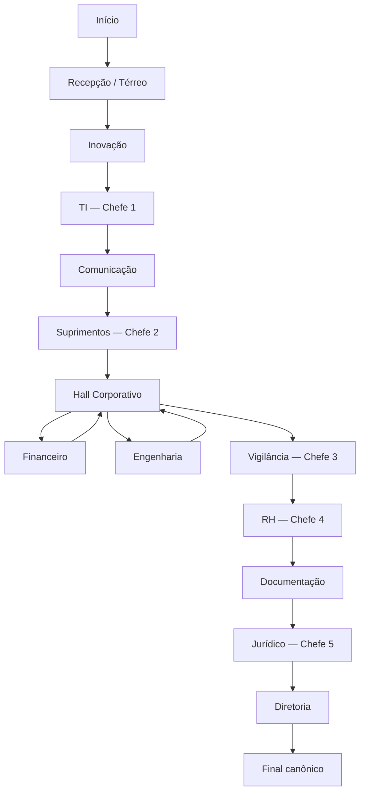

# Fluxograma jogável — PROTOCOLO: PIZZA

## Status

Documento de implementação da campanha completa. A rota narrativa, áreas, chefes, finais e conquistas já estão fechados para a primeira versão completa.

Este arquivo traduz o cânone para uma estrutura diretamente utilizável no protótipo HTML e, depois, no Godot.

Princípio-base:

`Cena → interação → condição → consequência → estado → próxima cena`

---

# 1. Fluxo macro



Financeiro e Engenharia podem ser visitados em qualquer ordem. O jogador pode avançar sem ter concluído ambos e descobrir uma exigência faltante depois, retornando pelo Hall.

---

# 2. Estado global da partida

## 2.1 Pizza

Representação sugerida:

```text
pizza.temperature = 100.0
pizza.integrity = 100.0
pizza.quantity = 100.0
pizza.elapsed_time = 0.0
pizza.possessed = true
```

As dimensões são independentes.

- **temperatura**: pode cair com o tempo e ser restaurada pelo micro-ondas do RH quando desbloqueado;
- **integridade**: representa danos físicos à pizza/caixa;
- **quantidade**: representa quanto da pizza ainda existe;
- **tempo decorrido**: cronômetro global da campanha;
- **posse**: indica se o entregador ainda está com a pizza.

Faixas de temperatura sugeridas como constantes ajustáveis:

```text
HOT_THRESHOLD = 70
COLD_THRESHOLD = 40
```

- 70–100: quente;
- 40–69: morna;
- abaixo de 40: fria.

O limite de atraso deve ser uma constante de balanceamento, não texto fixo de narrativa:

`MAX_DELIVERY_TIME`

## 2.2 Inventário / documentos

```text
visitor_badge
vr_glasses
executive_priority_stamp
third_party_proof
maintenance_vest
work_order
fiscal_exception_protocol
rh_validation_signature
legal_bolota_pending
legal_bolota_approved
```

## 2.3 Conhecimentos

Conhecimentos não ocupam inventário.

```text
director_name_known = false
director_name = "Ronaldo Gilberto"
cc_0001_known = false
```

## 2.4 Estados e flags principais

```text
reception_initial_dialogue_done
auditorium_speaker_route
innovation_low_collaboration
innovation_cleared
ti_cleared
communication_cleared
supplies_cleared
finance_resources_complete
engineering_resources_complete
maintenance_disguise_equipped
surveillance_cleared
rh_point_digital
rh_point_parallel
rh_validation_1
rh_validation_2
rh_microwave_unlocked
rh_cleared
documentation_cleared
legal_ticket_open
legal_external_authorization
legal_cleared
director_access_granted
```

## 2.5 Persistência fora da partida

Persistentes entre campanhas:

```text
achievements_unlocked
endings_seen
```

As 22 conquistas seguem `docs/05_CONQUISTAS.md`.

---

# 3. Recepção / Térreo

## REC-00 — Entrada

Hotspots iniciais:

- saída;
- balcão da Recepção;
- Sala de Espera;
- Auditório;
- posto de Segurança;
- elevadores.

### Saída

Se for o primeiro clique relevante da partida:

- desbloqueia conquista **Nem iniciou o jogo**;
- ativa **FINAL — ENTREGA ABANDONADA**.

Caso seja usada depois, ainda pode encerrar a entrega, mas sem a condição especial da conquista.

## REC-01 — Eliana Marli / diálogo inicial

O diálogo A/B/C/D aparece apenas uma vez.

### A — Entrega para o Diretor

Eliana confirma:

> — Pizza para a Diretoria? Para o Sr. Ronaldo Gilberto?

Estados:

```text
director_name_known = true
visitor_badge = true
reception_initial_dialogue_done = true
```

Feedback:

**INFORMAÇÃO ADQUIRIDA — Diretor: Ronaldo Gilberto**

Próximo objetivo: Segurança.

### B — “Quero entrar na empresa.”

Encaminha para o Auditório / onboarding.

Não substitui identificação nem os requisitos da rota principal.

### C — Entrega sem destinatário

**FINAL — DESTINO NÃO ENCONTRADO**

### D — Esperar alguém buscar

Entra na Sala de Espera.

## REC-02 — Sala de Espera

Após aproximadamente 15 segundos, Mauro Portela aborda o jogador.

- resposta adequada → permanece ou retorna à Recepção;
- resposta suspeita/agressiva/contraditória → **FINAL — VISITANTE RETIRADO**.

NPC recorrente pode ensinar a lógica de espera e tempo.

## REC-03 — Auditório

Lúcia Pauta confunde o jogador com o palestrante.

Rotas:

1. aceitar o papel → conquista **O palestrante atrasado** e acesso antecipado ao RH;
2. sustentar falsificação em excesso → **FINAL — IDENTIDADE FALSIFICADA**;
3. permanecer e concluir a situação → conquista **Uma palestra de sucesso**; pizza perde temperatura;
4. admitir engano → retorna ao fluxo normal.

O nome digitado pelo jogador pode ser salvo para uso cosmético em crachás/formulários da mesma campanha.

## REC-04 — Segurança

NPC: Mauro Portela.

Sem identificação:

- primeira abordagem → manda voltar à Recepção;
- insistência → pizza confiscada e expulsão → **FINAL — PIZZA APREENDIDA**.

Tentar atravessar fisicamente sem credencial e insistir:

**FINAL — ACESSO NÃO AUTORIZADO**

Com crachá válido:

- elevador 1 está em manutenção;
- elevador 2 está reservado ao presidente;
- escadas liberadas.

Saída correta:

`REC-04 → INO-00`

---

# 4. Inovação

## INO-00 — Área principal

NPCs:

- Caio Brusch;
- Bernardo Nolli.

Objetivo obrigatório:

**obter Óculos VR**.

Estado:

```text
vr_glasses = true
innovation_cleared = true
```

## INO-01 — Sala de Reunião

Interação sobre a ideia de fazer o destinatário buscar a própria pizza.

- apoiar a ideia até ela ser executada → **FINAL — INOVAÇÃO DEMAIS**;
- sair enquanto o funcionário continua falando → `innovation_low_collaboration = true`;
- responder “só quero entregar” → sem consequência.

## INO-02 — Banheiro

Interações repetidas com o vaso sanitário levam ao final:

**FINAL — ENTREGA POR ENCANAMENTO**

Conquista: **Logística Reversa**.

## Saída correta

Com VR:

`INO → TI-00`

---

# 5. TI — Chefe 1

## Estrutura

- TI principal;
- Sala de Servidores;
- Sala de Sistemas;
- Service Desk.

NPCs:

- Rogério Wilco;
- Samir Maxo;
- Jorge Stobarte.

## Puzzle correto

Usar **Óculos VR** em Rogério Wilco.

O equipamento vira incidente P1 e remove o bloqueio.

Estados:

```text
ti_cleared = true
processo_contornado_ti = true
```

Conquista:

**Primeiro processo contornado**

## Finais de TI

- TI principal / reunião → **FINAL — REUNIÃO RECORRENTE**;
- Sala de Servidores → **FINAL — INCIDENTE DE SEGURANÇA**;
- Sala de Sistemas → **FINAL — PIZZA AS A SERVICE**;
- Service Desk → **FINAL — ENTREGA DIGITALMENTE CONCLUÍDA**.

Saída correta:

`TI → COM-00`

---

# 6. Comunicação

## Estrutura

1. área principal;
2. Estúdio de Conteúdo;
3. Sala de Crise.

NPCs:

- Manny Calveira;
- Abril Riani.

Recursos obrigatórios:

```text
executive_priority_stamp = true
cc_0001_known = true
communication_cleared = true
```

Feedback de conhecimento:

**CC-0001 — Centro de custo da Diretoria**

Saída correta:

`COM → SUP-00`

---

# 7. Suprimentos — Chefe 2

## Estrutura

1. área principal;
2. Almoxarifado;
3. Sala de Compras.

NPCs:

- Stan Leilo;
- Murray Estoque.

## Puzzle correto

Pré-requisitos:

```text
executive_priority_stamp == true
cc_0001_known == true
```

Sequência correta:

1. informar Diretor;
2. informar CC-0001;
3. apresentar Prioridade Executiva;
4. classificar como compra emergencial;
5. justificar: **“Fome.”**

Estado:

```text
supplies_cleared = true
```

Feedback:

**PROCESSO CONTORNADO**

Conquista:

**Compra emergencial**

## Finais de Suprimentos

- Almoxarifado / três cotações → **FINAL — MENOR PREÇO**;
- Cadastro / degustação → **FINAL — FORNECEDOR HOMOLOGADO**;
- formalização completa → **FINAL — CADASTRO EM ANÁLISE**;
- inconsistência/lote → **FINAL — MATERIAL RETIDO**.

Saída correta:

`SUP → HALL-00`

---

# 8. Hall Corporativo — hub

## HALL-00

Conexões:

```text
← Financeiro
Engenharia →
↑ Vigilância
```

Financeiro e Engenharia podem ser feitos em qualquer ordem.

O Hall nunca causa Game Over.

Interações:

- mapa corporativo → conquista **Agora fiquei mais perdido**;
- NPC que continua esperando → conquista **Ainda esperando** quando visitado antes e depois da conclusão de uma das duas ramificações.

Regra importante:

O jogador pode tentar avançar antes de reunir todos os recursos futuros. Áreas posteriores devem informar a ausência do requisito e permitir backtracking.

---

# 9. Financeiro

## Estrutura

1. área principal;
2. Arquivo Financeiro.

NPCs:

- Bruno Basco;
- Fábio Tributo;
- Beto Rô.

## Recursos obrigatórios da campanha

### Comprovante de Prestador Terceirizado

```text
third_party_proof = true
```

Uso: RH.

### Protocolo de Exceção Fiscal

Obtido ao explicar que a pizza é para o Diretor.

```text
fiscal_exception_protocol = true
```

Uso: Jurídico.

Quando ambos estão disponíveis:

```text
finance_resources_complete = true
```

## Rotas opcionais

Sem NF:

**FINAL — PIZZA SOB CUSTÓDIA FISCAL**

Conquista: **Importação Irregular**.

Tratar dados da pizza como confidenciais:

- sem Game Over;
- conquista **Dados Protegidos**.

Saída:

`FIN → HALL-00`

---

# 10. Engenharia

## Estrutura

1. área principal;
2. Depósito / Área Técnica.

NPCs:

- Bento Tróti;
- Artur Viga.

## Recursos obrigatórios

Encontrar **Colete de Manutenção** e examinar seu bolso para obter a OS.

```text
maintenance_vest = true
work_order = true
engineering_resources_complete = true
```

## Risco opcional

Artur Viga pede para analisar estruturalmente a pizza.

- recusar → segue normalmente;
- aceitar → **FINAL — FALHA ESTRUTURAL**.

Saída:

`ENG → HALL-00`

---

# 11. Vigilância — Chefe 3

## Estrutura

1. Posto de Vigilância / área principal;
2. Sala de Monitoramento;
3. Acesso Restrito.

NPCs:

- Sônia Bondes;
- Gabriel Naito.

## Puzzle correto

Pré-requisitos:

```text
maintenance_vest == true
work_order == true
```

Passos:

1. usar o Colete no protagonista;
2. `maintenance_disguise_equipped = true`;
3. apresentar OS a Sônia.

Somente OS → falha.
Somente colete → falha.

Com ambos:

```text
surveillance_cleared = true
```

Feedback:

**ACESSO TÉCNICO AUTORIZADO**

**PROCESSO CONTORNADO**

Conquista: **Passou na cara dura**.

## Interações

- todos os monitores → **Big Brother Corporativo**;
- usar colete em três departamentos → **Agora eu trabalho aqui**.

## Finais

- permitir inspeção destrutiva → **FINAL — PIZZA EM QUARENTENA**;
- insistir sem requisitos → **FINAL — ÁREA RESTRITA**;
- aceitar tarefas sucessivas como manutenção → **FINAL — PROMOVIDO A TERCEIRIZADO**.

Saída correta:

`VIG → RH-00`

---

# 12. RH — Chefe 4

## Estrutura

1. Área principal — RH;
2. Controle de Ponto;
3. Cadastro de Terceiros.

NPCs:

- Helena Folha;
- Paulo Pontes;
- Caio Dastro.

## RH-00 — Helena

Pré-requisito:

```text
third_party_proof == true
```

Se não possuir, Helena bloqueia o processo e permite backtracking até Financeiro.

Com o comprovante:

recebe **Ficha de Validação de Terceiro — NÃO VALIDADA**.

## RH-01 — Controle de Ponto

Passos obrigatórios:

1. ponto digital;
2. controle paralelo.

Estados:

```text
rh_point_digital = true
rh_point_parallel = true
rh_validation_1 = true
```

## RH-02 — Cadastro de Terceiros

Tentativas erradas são humorísticas e não encerram a campanha.

Solução:

1. usar Comprovante no Validador de Prestadores Externos;
2. inserir Ficha.

Estado:

```text
rh_validation_2 = true
```

### Consequência da Inovação

Se:

```text
innovation_low_collaboration == true
```

abre diálogo extra.

- “Eu nem trabalho aqui...” → **FINAL — DEMITIDO ANTES DE SER CONTRATADO**;
- “A pizza esfriou...” → `rh_microwave_unlocked = true`;
- demais respostas → sem consequência grave.

### Micro-ondas

Se desbloqueado e `pizza.temperature < 100`:

```text
pizza.temperature = 100
```

Não altera integridade nem quantidade.

### Cadastro errado

Cadastrar como funcionário:

**FINAL — EFETIVADO POR ENGANO**

## RH-03 — Retorno à Helena

Com as duas validações:

recebe:

**Assinatura de Validação do RH**

```text
rh_validation_signature = true
rh_cleared = true
```

Feedback:

**PROCESSO CONTORNADO**

Saída:

`RH → DOC-00`

---

# 13. Documentação

## Estrutura

1. Atendimento de Documentação;
2. Arquivo / Reprografia.

NPCs:

- Célia Viana;
- Domingos Hurley.

Objetivo:

obter:

**Bolota do Jurídico — Pendente de Aprovação**

```text
legal_bolota_pending = true
documentation_cleared = true
```

Regra narrativa:

`Documentação cria o documento → Jurídico dá validade ao documento`

Saída:

`DOC → JUR-00`

---

# 14. Jurídico — Chefe 5

## Estrutura

1. Recepção / Secretaria;
2. Sala de Análise Jurídica.

NPCs:

- Laura Firma;
- Dr. Vítor Parecer.

## Pré-requisitos vindos da campanha

```text
legal_bolota_pending == true
rh_validation_signature == true
fiscal_exception_protocol == true
```

Se faltar qualquer um, o Jurídico fornece pista e permite backtracking.

## JUR-01 — Chamado

Usar o telefone da secretaria e ligar para TI.

```text
legal_ticket_open = true
```

Feedback:

**CHAMADO ABERTO — Nº 48271**

## JUR-02 — Autorização externa

Após o chamado, o telefone toca.

Atender:

```text
legal_external_authorization = true
```

Se ignorar, toca novamente depois.

## JUR-03 — Análise 5/5

Checklist:

1. Chamado;
2. Bolota;
3. Assinatura;
4. Protocolo;
5. Autorização externa.

Com os cinco:

```text
legal_bolota_pending = false
legal_bolota_approved = true
legal_cleared = true
```

Feedback:

**PROCESSO JURÍDICO CONCLUÍDO**

**PROCESSO CONTORNADO**

## Finais

- aceitar termos repetidamente → **FINAL — LI E ACEITO**;
- insistir em aprovação incompleta → **FINAL — EM ANÁLISE**.

Saída correta:

`JUR → DIR-00`

---

# 15. Diretoria

## Estrutura

1. Recepção da Diretoria;
2. Sala do Diretor.

NPCs:

- Carla Agenda;
- Ronaldo Gilberto.

## DIR-00 — Carla Agenda

Não exige:

- crachá;
- protocolo;
- Assinatura;
- Bolota;
- autorização;
- chamado.

Pergunta única:

> — Qual o nome do diretor?

Resposta correta:

**Ronaldo Gilberto**

```text
director_access_granted = true
```

Erro isolado → tentar novamente.
Erros repetidos → **FINAL — DIRETOR DESCONHECIDO**.

## DIR-01 — Sala do Diretor

Avaliação global da entrega, nesta ordem:

1. `pizza.possessed == false` ou `pizza.quantity <= 0` → **FINAL — SEM PIZZA**;
2. `pizza.elapsed_time > MAX_DELIVERY_TIME` → **FINAL — ENTREGA TARDE DEMAIS**;
3. `pizza.temperature < COLD_THRESHOLD` → **FINAL — PIZZA FRIA**;
4. pizza válida → final canônico.

Integridade abaixo do ideal pode alterar reação/linha de diálogo, mas não cria novo final na primeira versão enquanto ainda houver pizza válida para entrega.

### Final canônico

Ronaldo recebe a pizza.

Depois, o celular do protagonista recebe um novo pedido para o mesmo prédio / último andar.

Tela:

**PROTOCOLO: PIZZA**

**ENTREGA CONCLUÍDA**

**NOVO PROTOCOLO INICIADO**

Conquista:

**PROTOCOLO: PIZZA**

---

# 16. Backtracking obrigatório

O jogo nunca deve criar softlock por falta de item/documento.

Regras:

- Vigilância sem Colete/OS → jogador pode retornar ao Hall/Engenharia;
- RH sem Comprovante → jogador pode retornar ao Hall/Financeiro;
- Jurídico sem Protocolo → retornar ao Financeiro;
- Jurídico sem Assinatura → retornar ao RH;
- Jurídico sem Bolota → retornar à Documentação;
- ligação externa perdida → telefone toca novamente;
- nome do Diretor errado → novas tentativas antes do final por repetição.

Nenhum item obrigatório pode ser descartado permanentemente em uma rota que continue a campanha.

---

# 17. Tratamento de finais

Função lógica sugerida:

```text
trigger_ending(ending_id):
    endings_seen.add(ending_id)
    unlock_related_achievement_if_any()
    save_persistent_progress()
    show_ending_screen()
    offer_restart_or_menu()
```

Finais alternativos encerram a campanha atual, mas não apagam conquistas nem finais já registrados.

---

# 18. Estrutura sugerida para Godot

## Autoloads

### `GameState.gd`

Responsável por:

- inventário;
- conhecimentos;
- flags da campanha;
- estado da pizza;
- cronômetro global.

### `AchievementManager.gd`

Responsável por:

- catálogo das 22 conquistas;
- persistência;
- condição de **100% Conforme**.

### `EndingManager.gd`

Responsável por:

- registrar finais vistos;
- disparar tela de final;
- associar final a conquista quando aplicável.

### `SceneRouter.gd`

Responsável por:

- mudança de cena;
- ponto de retorno;
- backtracking;
- transições.

### `SaveManager.gd`

Separar:

- **save da campanha atual**;
- **progresso persistente** de conquistas/finais.

## Estrutura de pastas sugerida

```text
res://
  autoload/
    GameState.gd
    AchievementManager.gd
    EndingManager.gd
    SceneRouter.gd
    SaveManager.gd
  scenes/
    reception/
    innovation/
    ti/
    communication/
    supplies/
    hall/
    finance/
    engineering/
    surveillance/
    hr/
    documentation/
    legal/
    directorate/
    endings/
  data/
    dialogues/
    items/
    achievements/
    endings/
  ui/
    inventory/
    dialogue/
    achievements/
    pause/
```

---

# 19. Ordem recomendada de implementação

1. criar `GameState`;
2. implementar navegação entre cenas;
3. implementar inventário e conhecimento;
4. implementar Recepção completa;
5. implementar Inovação → TI;
6. Comunicação → Suprimentos;
7. Hall + Financeiro + Engenharia + backtracking;
8. Vigilância;
9. RH;
10. Documentação;
11. Jurídico;
12. Diretoria e avaliação global da pizza;
13. finais alternativos;
14. conquistas persistentes;
15. save/load;
16. playtest integral e balanceamento de tempo/temperatura.

---

# 20. Regra de escopo da primeira versão completa

A primeira versão jogável completa deve priorizar:

- toda a rota canônica funcional;
- todos os finais fechados no catálogo;
- todas as 22 conquistas;
- backtracking sem softlocks;
- estado da pizza funcionando;
- nomes e diálogos canônicos principais;
- humor ambiental suficiente para representar cada área.

Novos finais, conquistas, departamentos ou sistemas só serão avaliados após o primeiro playtest integral.
